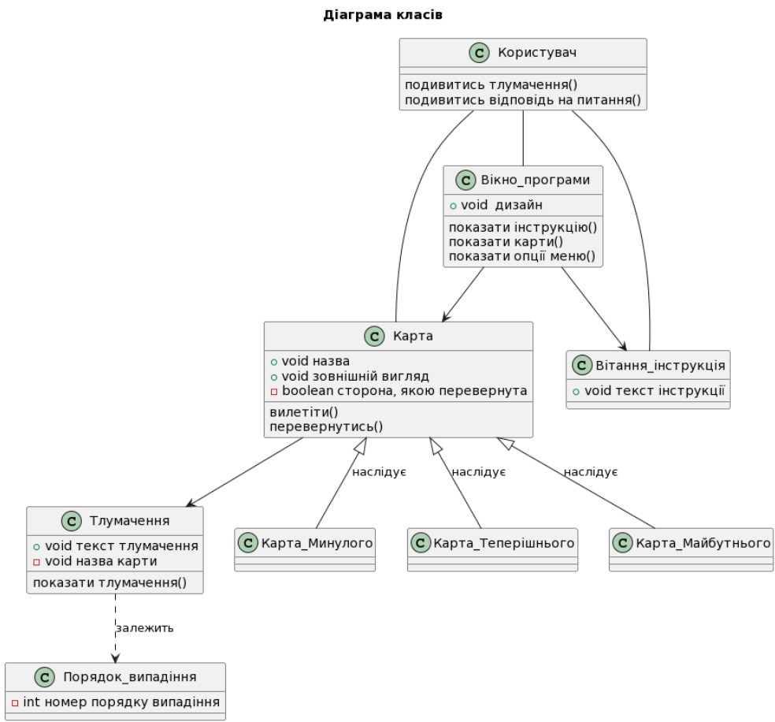

# КОНЦЕПЦІЯ ПРОЕКТУ

Етап: *Аналізу проекту (Envisioning)*

Проект: *Застосунок для “ворожіння” на “картах Таро”*

Команда: *КіберВорожки*

Виконали:
>Жаботинська

>Доровских

## **1. НЕОБХІДНІСТЬ ПРОЕКТУ**

Ітеративний підхід до процесу розробки (характерний для MSF) вимагає використання гнучкого способу ведення документації - *живі документи (living documents)* мають змінюватися в ході еволюції проекту. Такий підхід істотно відрізняється від принципів ведення документації каскадної моделі, де процес розробки починається лише після того, як будуть готові і зафіксовані всі вимоги і специфікації.

Документація проектів MSF, як і їх програмний код, створюється ітеративно. На *фазі створення концепції (аналізу)* плани мають форму опису високорівневих *підходів* і в процесі підготовки поширюються серед членів проектної групи та інших зацікавлених осіб для отримання відгуків. 

Наприклад, підхід до тестування може бути коротко сформульований під час фази аналізу, а його перетворення в план тестування відбувається на пізніх фазах. Після переходу до *фази планування* документи поступово допрацьовуються, виникають детальні плани які знову надходять на перевірку всіма зацікавленими сторонами, і описаний процес повторюється ітеративно. Типи планів і загальна кількість документів, які їх описують, можуть змінюватись від проекту до проекту

### **1.1. Обгрунтування необхідності**

Проект спрямований на зацікавлення абітурієнтів та їх батьків нашою спеціальністю та вступом у наш коледж  через цікавий та яскравий ігровий продукт. Також можливе використання для "справжнього ворожіння".

### **1.2. Бачення проекту**

*Бачення (vision)* - це нічим не обмежене уявлення про те, яким має бути рішення (solution). Бачення проекту спрямоване на формування єдиного розуміння концепції проекту всіма залученими сторонами. 

Формулювання бачення або *vision statement* має бути досить коротким для запам'ятовування, досить ясним для розуміння і досить сильним для мотивації. Коректне формулювання бачення відповідає п'яти характеристикам SMART:

- **Specific** (визначеність / конкретність) - бачення чітко вказує на той (ідеальний) стан, досягнення якого є метою проекту
- **Measurable** (вимірюваність) - дає проектній групі чіткий критерій успішності проекту і досягнення поставлених цілей
- **Achievable** (досяжність) - цілі, сформульовані в баченні, мають бути досяжні в рамках наявних ресурсів, часу і можливостей команди. Досяжність мотивує команду на виконання проекту.
- **Relevant** (обгрунтованість) - цілі, сформульовані в баченні, повинні мати істотне значення для зацікавлених сторін і безпосередньо бути пов'язаними з їх проблемами та/або потребами.
- **Time-based** (обмеженість у часі) - бачення має чітко вказувати на очікувані часові рамки, в які рішення буде створене.

Проект є веб-застосунком, що дає змогу вступникам пограти у гадання і по картам дізнатись свою подальшу долю.
Таким чином застосунок є рекламою для залучення нових студентів.

### **1.3. Аналіз вигод**

В результаті впровадження веб-застосунку для "ворожіння", зацікавлені сторони отримають наступні вигоди:
- Відділення комп'ютерних технологій
   - впровадження інноваційного та цікавого ігрового формату залучення вступників
   - збільшення кількості охочих вступити на спеціальність
   - вирішення проблеми з створенням реклами спеціальності
   - підвищення пізнаваності коледжу, виокремлення від закладів-конкурентів

- Абітурієнти
   - цікаво проведений час, отримання веселих емоцій
   - визначення у виборі спеціальності та навчального закладу для вступу
   - краще знайомство зі спеціальністю "Інженерія програмного забезпечення", відповіді на питання щодо вступу
 
## **2. КОНЦЕПЦІЯ РІШЕННЯ**

*Концепція рішення* (solution concept) надає загальний опис підходів, які проектна група планує використовувати для вирішення проблем та/або задоволення вимог зацікавлених сторін.

### **2.1. Цілі та Завдання**
Формування концепції рішення починається зі з'ясування, опису та фіксації проектною групою цілей проекту. Далі кожна мета розбивається на вимірювані компоненти - *завдання*.

Основні *цілі проекту* з створення застосунку для “ворожіння” на “картах Таро” (відповідні завдання показані у вигляді списку другого рівня): 
- **залучення уваги користувачів до спеціальності**
   - випадкове генерування "карт Таро" у стилі кіберпанку
   - веб-інтерфейс у стилі кіберпанку для перегляду згенерованих "карт Таро"
   - веб-інтерфейс у стилі кіберпанку для перегляду інформації про згенеровані "карти Таро"
   - виведення на фінальному екрані логотипу спеціальності (з описом і посиланням на сайт) та тексту, що закликає вступити на навчання до даної спеціальності

### **2.2. Припущення і Обмеження**
У процесі формування концепції проектна група постійно взаємодіє з зацікавленими сторонами, збираючи необхідну інформацію про вимоги до функціональності майбутнього рішення. Однак, неминуча *неповнота інформації* призводить до того, що стосовно деяких функціональних можливостей рішення можуть знадобитися *припущення* (assumptions). 

Крім функціональних вимог зацікавлені сторони можуть висувати якісні (нефункціональні) вимоги, які задають *обмеження* створюваного рішення. Також *обмеження можуть породжуватись середовищем*, в якому повинно буде функціонувати рішення після впровадження.

Основні *припущення* стосовно функціональності проекту зі створення застосунку для “ворожіння” на “картах Таро”: 
- при запуску застосунок повинен вивести вітання та пояснення ідеї ворожіння (один екран з текстовою інформацією та графічними ілюстраціями)
- при трясінні телефону застосунок повинен вивести на екран “карту” з короткою назвою
- після трьох рухів на екрані повинно бути три карти та кнопка “дізнатись деталі”
- на сторінці деталей для минулого, сьогодення і майбутнього відображаються відповідні карти з їх детальним “тлумаченням”

*Обмеження*, які слід враховувати:
- продукт має бути доступний на будь-якому пристрої з підключенням до Інтернету
- продукт має бути створений з використанням стандартного стеку технологій HTML/CSS/JavaScript
- використання Canvas API або SVG-графіки тощо
- використання популярних бібліотек (jQuery тощо)
- продукт має бути захощений прямо в репозиторії за допомогою GitHub Pages

### **2.3. Аналіз використання**
Основою формулювання вимог є аналіз використання, що включає визначення *користувачів* (users) і опис того, як користувачі будуть *взаємодіяти* з рішенням.

#### КОРИСТУВАЧІ

У розробці рішення зацікавлені безліч сторін, проте безпосередньо  з ним будуть працювати саме користувачі, тому перш ніж починати проектування рішення, необхідно визначити, хто буде з ним взаємодіяти.

В процесі аналізу мають бути виділені *групи користувачів* (наприклад, на основі галузей їх діяльності, в яких використовуватиметься рішення, що розробляється).

З застосунком для “ворожіння” на “картах Таро” будуть взаємодіяти наступнні групи користувачів:
- Абітурієнти
- Батьки абітурієнтів

#### СЦЕНАРІЇ ВИКОРИСТАННЯ

*Сценарії використання* (usage scenarios або *прецеденти*) визначають послідовності дій, які користувачі виконують при взаємодії з рішенням. MSF не змушує використовувати конкретні способи опису сценаріїв використання, однак містить рекомендації стосовно використання мови UML (*діаграма прецедентів*) - це один з можливих і досить поширених варіантів.

### **2.4. Вимоги**
Вимоги (requirements) визначають, що має робити рішення, яке ви розробляєте (які послуги надавати користувачам). Вимоги можуть бути описані в термінах *функціональності* або у вигляді правил і параметрів, які визначають функціональність.

#### ВИМОГИ КОРИСТУВАЧІВ

Основні вимоги до функціональності проекту зі створення застосунку для “ворожіння” на “картах Таро” виглядають наступним чином: 
- випадкове генерування "карт Таро"
- відображення згенерованих "карт Таро"
- відображення інформації про згенеровані "карти Таро"
- продукт має бути доступний на будь-якому пристрої з підключенням до Інтернету

#### СИСТЕМНІ ВИМОГИ

Системні вимоги до продукту: 
- продукт має бути доступний на будь-якому пристрої з підключенням до Інтернету
- продукт має бути створений з використанням стандартного стеку технологій HTML/CSS/JavaScript
- використання Canvas API або SVG-графіки тощо
- використання популярних бібліотек (jQuery тощо)

### **2.5. Рамки**
Рамки (scope) визначають *параметри* створюваного рішення, деталізуючи функціональність, визначаючи, що залишиться за рамками рішення і вказуючи *критерії*, за якими зацікавлені особи будуть судити про готовність рішення. Рамки створюються на основі *єдиного бачення*, є результатом *компромісу між сформульованими цілями та умовами реальності* і відображають *пріоритезацію замовником наявних вимог* до створюваного рішенням. Частиною процесу визначення рамок проекту є винесення не надто важливої функціональності з поточного проекту в плани на майбутнє.

*Рамки рішення* (solution scope) визначають *функціональність* рішення і його можливості (включаючи ті, що не стосуються програмного забезпечення). Можливість (функціональність, складова, *feature*) - це необхідний або бажаний аспект програмного або апаратного забезпечення. 

Наприклад, попередній перегляд перед друком може бути можливістю текстового процесора; шифрування поштових повідомлень - можливістю поштової програми. Супровідні документи для користувачів, інтерактивні файли допомоги, операційна документація і навчання персоналу також можуть бути складовими вирішення.

*Рамки проекту* (project scope) визначають *обсяг робіт*, який має бути виконаний проектною групою для надання замовнику всіх елементів, визначених рамками рішення.

*Керування рамками проекту є критичним для його успіху*. MSF пропонує визначати і фіксувати рамки рішення і проекту, використовуючи *трикутник компромісів* і *матрицю компромісів* проекту.

#### ФУНКЦІОНАЛЬНІСТЬ РІШЕННЯ

Основні *можливості* застосунку для “ворожіння” на “картах Таро”:
- при трясінні телефону застосунок повинен вивести на екран “карту” з короткою назвою
- випадкове генерування "карт Таро"
- відображення згенерованих "карт Таро"
- відображення інформації про минуле, сьогодення і майбутнє згенерованих "карт Таро"
- виведення на фінальному екрані логотипу спеціальності (з описом і посиланням на сайт) та тексту, що закликає вступити на навчання до даної спеціальності

#### ЗА РАМКАМИ РІШЕННЯ

:point_right: Вкажіть тут функціональність, яка є або передбачається у вимогах зацікавлених сторін, але не буде реалізована в рішенні, і опишіть причини винесення даних можливостей і функцій за рамки рішення (використовуйте трикутник компромісів).

:bulb: *Це може виглядати, наприклад, так:*
>З огляду на фіксований термін роботи над проектом за рамки рішення команда вирішила винести наступні можливості:
>- Push-повідомлення в мобільний застосунок (запити на звірку, повідомлення від навчальної частини тощо)
>- інтеграція системи з Телеграм-ботом коледжу (перегляд даних про вичитані години та години, які залишился, в інтерфейсі внесення змін)

### **2.6. Критерії схвалення рішення**

Рішення про готовність застосунку для “ворожіння” на “картах Таро” замовник буде приймати на основі наступних *критеріїв*:
- реалізовано всю функціональність, описану в цьому документі (окрім можливостей, які за межами рішення)
- застосунок надійний, ефективний та легкий для використання
- застосунок доступний на будь-якому пристрої з використанням Інтернету, пройшов всі тести та використовується користувачами

## **3. СТРАТЕГІЇ ПРОЕКТУВАННЯ РІШЕННЯ**
### **3.1. Стратегія архітектурного проектування**

На основі розробленого списку можливостей і функцій формується *стратегія архітектурного проектування* (architectural design strategy), яка описує рішення в цілому. 

Стратегія архітектурного проектування визначає *компоненти* рішення і їх *взаємодію*. Чудовий спосіб опису рішення на цьому етапі - використання ілюструючих діаграм UML (наприклад, **діаграми класів**, **діаграми компонентів**, **діаграма розгортання** тощо).

### **3.2. Стратегія технологічного проектування**

Розробка рішення потребує використання певних *програмних продуктів, бібліотек, фреймворків, технологій*. 

Стратегія технологічного проектування (technical design strategy) описує, які технології і програмні продукти були обрані проектною групою у якості засобу реалізації рішення.

- мова програмування JavaScript:
   - середовище розробки Visual Studio Code
   - додаткові бібліотеки (для розпізнавання трясіння телефону)
- хмарна платформа GitHub для розміщення вихідного коду та документації до застосунку 

---

- [x] Жаботинська
- [x] Доровских

---
[:arrow_up: Повернутись до початку етапу](/docs/1.Envisioning/README.md)
