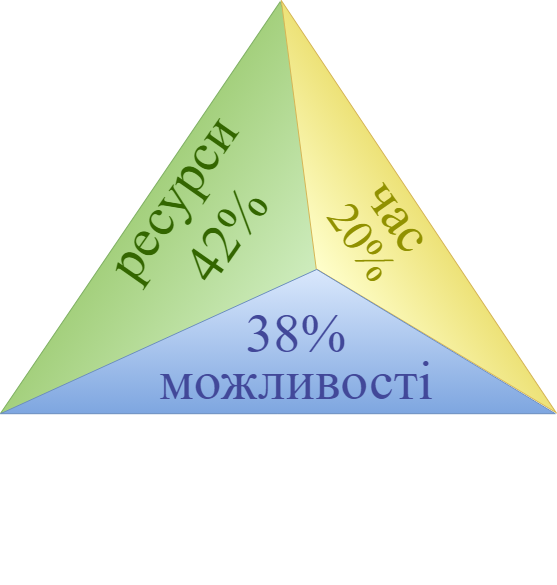
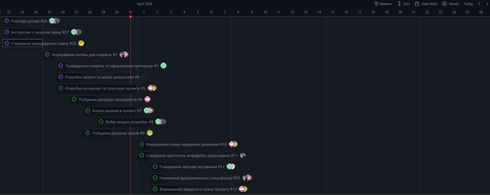

# СТРУКТУРА ПРОЕКТУ

Етап: *Аналізу проекту (Envisioning)*

Проект: *Застосунок для “ворожіння” на “картах Таро”*

Команда: *КіберВорожки*

Виконали:
>Жаботинська

>Доровских

## **1. ЦІЛІ ТА ЗАВДАННЯ**

Документ "Структура проекту" включає в себе інформацію про *організацію проектної групи*, персоніфікацію *ролей* і відповідальності. Також документ роз'яснює *схеми взаємодії проектної групи із замовником* і замовника - з проектною групою.

Формування концепції рішення починається з обговорення з зацікавленими сторонами, опису та фіксації проектною групою *цілей проекту*. Далі кожна мета розбивається на вимірювані компоненти -* завдання*.

Основні *цілі проекту* з створення застосунку для “ворожіння” на “картах Таро” (відповідні завдання показані у вигляді списку другого рівня): 
- **залучення уваги користувачів до спеціальності**
   - випадкове генерування "карт Таро" у стилі кіберпанку
   - веб-інтерфейс у стилі кіберпанку для перегляду згенерованих "карт Таро"
   - веб-інтерфейс у стилі кіберпанку для перегляду інформації про згенеровані "карти Таро"
   - виведення на фінальному екрані логотипу спеціальності (з описом і посиланням на сайт) та тексту, що закликає вступити на навчання до даної спеціальності

## **2. ПРИПУЩЕННЯ І ОБМЕЖЕННЯ**
У процесі формування концепції проектна група постійно взаємодіє з зацікавленими сторонами, збираючи необхідну інформацію про вимоги до функціональності майбутнього рішення. Однак, неминуча *неповнота інформації* призводить до того, що стосовно деяких функціональних можливостей рішення можуть знадобитися *припущення (assumptions).* 

Крім функціональних вимог зацікавлені сторони можуть висувати *якісні вимоги*, які задають *обмеження* створюваного рішення. Також обмеження можуть породжуватись середовищем, в якому буде функціонувати рішення після впровадження.

Основні *припущення* стосовно функціональності проекту зі створення застосунку для “ворожіння” на “картах Таро”: 
- при запуску застосунок повинен вивести вітання та пояснення ідеї ворожіння (один екран з текстовою інформацією та графічними ілюстраціями)
- при трясінні телефону застосунок повинен вивести на екран “карту” з короткою назвою
- після трьох рухів на екрані повинно бути три карти та кнопка “дізнатись деталі”
- на сторінці деталей для минулого, сьогодення і майбутнього відображаються відповідні карти з їх детальним “тлумаченням”

*Обмеження*, які слід враховувати:
- продукт має бути доступний на будь-якому пристрої з підключенням до Інтернету
- продукт має бути створений з використанням стандартного стеку технологій HTML/CSS/JavaScript
- використання Canvas API або SVG-графіки тощо
- використання популярних бібліотек (jQuery тощо)
- продукт має бути захощений прямо в репозиторії за допомогою GitHub Pages

## **3. РАМКИ ПРОЕКТУ**
*Рамки (scope)* визначають *параметри* створюваного рішення, деталізуючи *функціональність*, визначаючи, що залишиться за рамками рішення і вказуючи *критерії*, за якими зацікавлені особи будуть судити про готовність рішення. 

Рамки створюються на основі *єдиного бачення*, є результатом *компромісу* між сформульованими цілями та умовами реальності і відображають *пріоритезацію* замовником наявних вимог до створюваного рішення. Частиною процесу визначення рамок проекту є винесення не надто важливої функціональності з поточного проекту в *плани на майбутнє*.

*Рамки проекту (project scope)* визначають обсяг робіт, який має бути виконаний проектною групою для постачання замовникову кожного з елементів, визначеного рамками рішення.

Керування рамками проекту є критичним для його успіху. MSF пропонує визначати і фіксувати рамки рішення і проекту, використовуючи такі інструменти як *трикутник компромісів* і *матриця компромісів проекту*.

### **3.1. Матриця компромісів проекту**

Досвічені керівники проекті добре знають про взаємозалежність між ресурсами проекту (людськими і фінансовими), його календарним графіком (часом) і реалізованими можливостями (рамками). Ці три змінні утворюють ***трикутник компромісів (tradeoff triangle),*** показаний на рисунку:

Знаходження [правильного балансу між ресурсами, часом розробки і можливостями](/docs/images/resources/2of3.jpg) - ключовий момент в побудові рішення, яке належним чином відповідає потребам замовника.

Інший дуже корисний засіб для управління проектними компромісами - ***матриця компромісів проекту (project tradeoff matrix)***, показана на наступному малюнку. Вона відображає досягнуту на ранніх етапах проекту угоду між проектною групою і замовником про вибір пріоритетів у   можливих в майбутньому компромісних рішеннях. У певних випадках з цієї пріоритезації можуть робитися винятки, але в цілому її використання полегшує досягнення угод щодо спірних питань.

Цей малюнок демонструє матрицю компромісів проекту, використовувану зазвичай [проектними групами Майкрософт](https://support.microsoft.com/uk-ua/office/%D1%82%D1%80%D0%B8%D0%BA%D1%83%D1%82%D0%BD%D0%B8%D0%BA-%D0%BF%D1%80%D0%BE%D0%B5%D0%BA%D1%82%D1%83-8c892e06-d761-4d40-8e1f-17b33fdcf810). 

Принципово важливою є наявність у проектної групи і замовника єдиної, однозначної точки зору на матрицю компромісів проекту.

### **3.2. Віхи проекту**

*Віхи проекту* - це істотні події в життєвому циклі проекту. На фазі створення концепції (аналізу) зазвичай "виставляються" зовнішні віхи, які відображають досягнення видимих цілей проекту. На самому верхньому рівні в якості зовнішніх віх можуть розглядатися *закінчення фаз виконання проекту*. В залежності від природи проекту віхи можуть бути засновані на фінансових витратах, на прогресі у проекті, на часових проміжках тощо. Приклади віх проекту, які зазвичай виділяються в MSF, ви можете побачити на [цьому малюнку](/docs/images/resources/%D0%A4%D0%B0%D0%B7%D0%B8%20%D1%96%20%D0%B2%D1%96%D1%85%D0%B8%20%D0%BF%D1%80%D0%BE%D1%86%D0%B5%D1%81%D1%83.png).

Раннє визначення віх дозволяє встановити точки на тимчасовому графіку проекту, за яким зацікавлені сторони і проектна група судитимуть про хід його виконання.

Основними віхами даного проекту на кожному з етапів життєвого циклу є:
- Аналіз
   - ядро проектної групи сформовано, ролі розподілені
   - чорновики концепції та структури проекту складено
   - концепцію проекту затверджено
- Проектування
   - модель розробки обрана
   - план керування ризиками створено
   - прототип інтерфейсу створений
   - розроблений зведений план проекту та написана функціональна специфікація
   - зведений план проекту затверджений
- Розробка
   - програмний код проекту написаний
   - функціональна специфікація написана
   - довідка з використання написана
   - інтерфейс користувача розроблений
   - специфікація та сценарії тестів написані
- Тестування
   - тестування виконано
   - помилки виправлено, написано звіт про помилки
   - здійснено пілотне впровадження
- Розгортання
   - отримано відгук від замовника
   - написано звіт по завершенню роботи
   - документ "постпроектний аналіз" заповнений

### **3.3. Кошториси проекту**
Виконання проекту передбачає використання *ресурсів* і має на увазі наявність *витрат*. 

*Ресурси* - це люди, обладнання, різні витратні матеріали тощо. Витрати розраховуються на основі тарифів (розцінок) на кожен вид необхідного ресурсу. В цьому розділі має бути представлена інформація про:

- список **видів ресурсів**,
- необхідну **кількість** кожного ресурсу,
- **тариф** на кожен вид ресурсу,
- загальну **вартість кожного ресурсу**,
- загальну **вартість всіх ресурсів**, необхідних проектній групі.

На основі інформації даного розділу має розраховуватись бюджет проекту. Також цей етап - чудова можливість ідентифікувати *специфічні ресурси*, які можуть бути необхідними для виконання проекту.

 | №  | Назва ресурсу | Кількість | Вартість за од, грн. | Всього, грн |
 |----|---------------|-----------|----------------------|--------|
 | 1  | Ліцензія на Visual Studio | 2 | 1645.00 | 3290.00 |
 | 2  | Доступ до Internet | 1 міс | 450.99    | 450.99 |
 | 3  | Зарплатня членів команди | 10 | 15000.00    | 150000.00 |
 | 4  | Ліцензія на MS Office | 2 | 400.00    | 800.00 |
 | 5  | Тарифний план Pro у Github  | 4 | 160.00  | 640.00 |
 | 6  | Плата за комунальні послуги | 1 міс. | 3200.00 | 3200.00 |
 | 7  | Оренда приміщення 60 м.кв. | 1 міс. | 11000.00 | 11000.00 | 
 | 8  | Кава/чай | 460 | 18.50 | 8510.00 |
 | 9  | Канцелярне приладдя | 20 | 30.76 | 615.20 | 
 |  |  |  |Всього:    | 178506.19 |

### **3.4. План-графік проекту**

## **4. РОЛІ ТА ВІДПОВІДАЛЬНОСТІ**
У цьому розділі описується структура проектної групи. Чіткі вимоги до кваліфікації, ролей і відповідальностей членів проектної групи дозволяють менеджеру проекту правильно підібрати команду і дають кожному розуміння його особистого внеску в загальний успіх проекту.

### **4.1. Знання, вміння і навички**
Учасники проектної групи мають відповідати певним вимогам для успішного виконання проекту. Ці вимоги виражаються в термінах знань, умінь і навичок і повинні включати технічні, управлінські та інші здібності. На самому верхньому рівні формулювання необхідних знань, умінь і навичок можуть грунтуватися на стандартних ролях MSF.

|№  | Роль в проекті            | Оригінальна назва ролі    | Вимоги         |
|---|---------------------------|---------------------------|-----------------------------|
| 1 | Менеджер програми         | Program Management        |навички і досвід управління пректами;  вміння приймати непрості рішення; навички комунікації; здатність ефективно комунікувати з командою;          |
| 2 | Менеджер продукту         | Product Management        | навички ділового спілкування;  здатність тонко відчувати побажання замовника; орієнтування на ринку, розуміння бізнесу; вміння будувати стратегії та стратегічні цілі компанії;|
| 3 | Розробник                 | Development               | знання мов програмування; вміння будувати алгоритми і орієнтуватись в них;  вміння оптимізувати та структурувати код; |
| 4 | Тестувальник              | Test                      | знання основних методів і принципів тестування; здатність виявляти незначні недоліки і слабкі місця в програмному коді;|
| 5 | UX-спеціаліст             | User Experience           | досвід розробки дизайну програмного забезпечення; здатність зробити застосунок зручним та адаптивним для користування; базові знання кольорознавства та композиції;            |
| 6 | Спеціаліст з розгортання  | Release Management        | знання мережевих протоколів т аопераційних систем; досвід роботи з інструментами розгортання програмного забезпечення; гарні навички комунікації; аналітичні навички, здатність швидко виправити помилки;|

### **4.2. Структура команди**

|№  | Роль в проекті            | Оригінальна назва ролі    | Прізвище, ініціали          |
|---|---------------------------|---------------------------|-----------------------------|
| 1 | Менеджер програми         | Program Management        | Жаботинська С.Я.            |
| 2 | Менеджер продукту         | Product Management        | Доровских Д.О., Волощук Д.О.|
| 3 | Розробник                 | Development               | Грисенко А.О., Єрмолов В.В. |
| 4 | Тестувальник              | Test                      | Букало І.В., Дерев'янко О.Р.|
| 5 | UX-спеціаліст             | User Experience           | Дворовенко М.С.*            |
| 6 | Спеціаліст з розгортання  | Release Management        | Дядечко О.С., Агуреєв І.П.  |

[:arrow_up: Посилання на файл team.md](/docs/1.Envisioning/team.md)

## **5. ПРОТОКОЛИ ПРОЕКТУ**
Протоколи проекту - це набір описів процесів в проекті, які мають бути затверджені, щоб усі учасники команди діяли в однаковому ключі. 

*Стандартизація підвищує продуктивність і полегшує спілкування як усередині проектної групи так і з зацікавленими сторонами.*

### **5.1. Керування ризиками**

MSF приділяє велику увагу роботі з ризиками в проекті. На стадії створення концепції цьому присвячений *окремий документ "[Оцінка ризиків](/docs/1.Envisioning/%D0%9E%D1%86%D1%96%D0%BD%D0%BA%D0%B0%20%D1%80%D0%B8%D0%B7%D0%B8%D0%BA%D1%96%D0%B2.md)"*.

 |Пріоритет|Причина|Наслідок|Ймовірність|Загроза|Очікувана величина|
| :- | :- | :- | :- | :- | :- |
|1|Недостатня кваліфікація кадрів|незадоволений клієнт, неякісний продукт, втрата хорошої репутації|60%|4|2.4|
|2|Незацікавлені члени команди у створенні якісного застосунку|погана якість програмного забезпечення, затримка термінів здачі|60%|	4|	2,4|
|3|Перевтома членів команди, погіршення психічного стану |	вплив на якість програмного забезпечення|50%|	3|	1,5|
|4|Досягнення неповної функціональності програми|	незадовільний продукт, проблеми з замовником, погіршення репутації|	40%|3|1,2|
|5|Порушення термінів виконання завдань |	проблеми з замовником, погіршення репутації	|30%	|4	|1,2|
|6|Незадовільне тестування продукту перед випуском|	затримка випуску у часі, негативний вплив на репутацію, втрата клієнтів|	25%|	4|	1|
|7|Незрозумілі або недостатньо деталізовані вимоги|	неправильна реалізація функціональності	|20%	|4	|0,8|
|8|Відсутність електроенергії або інші технічні проблеми|	затримка у часі, зменшення можливості створити якісне програмне забезпечення	|25%|	3|	0,75|
|9|Раптове погіршення фізичного стану здоров'я членів команди|	зменшення швидкості виконання завдань етапів програми або її відсутність	|30%|	2|	0,6|
|10|Втрата даних через неналежне резервне копіювання|	втрата важливих даних або програмних ресурсів	|30%	|2|	0,6|
|11|Конфлікти у команді|	затримки у роботі, зниження продуктивності	|10%|	3|	0,3|
|12|Перенавантаження або збої роботи GitHub|	тимчасова втрата доступу до файлів завдань, затримка виконання завдань у часі	|5%|	3|	0,15|

Результати мозкового штурму стосовно проектних ризиків наведено у таблиці [аналізу проектних ризиків](/docs/1.Envisioning/other/Аналіз_проектних_ризиків.xlsx).

### **5.2. Керування конфігурацією**

Більшість складових частин рішення в процесі роботи над проектом зазнають неодноразових змін, отже, проект потребує певної стратегії *керування конфігурацією,* яка визначає обрані методи відстеження змін, ведення звітності тощо. Керування конфігурацією має охоплювати проектну документацію, середовища розробки і тестування та будь-які зміни в проектному середовищі в цілому.

Для контролю версій використовується GitHub.
| Прізвище та ініціали            | Роль в проекті    | Дії у репозиторії         |
|---------------------------|---------------------------|-----------------------------|
| Жаботинська С.Я.         | Program Management        |  створення репозиторію, створення issues та календарного плану, редагування календарного плану, заповнення документації|
| Доровских Д.О.        | Product Management        | заповнення документації, додавання діаграм|
| Волощук Д.О.        | Product Management        | заповнення документації|
| Грисенко А.О.                 | Development               |завантаження вихідного коду, заповнення документації |
| Єрмолов В.В.                 | Development               | завантаження вихідного коду, заповнення документації|
| Букало І.В.              | Test                      |заповнення документації |
| Дерев'янко О.Р.              | Test                      |заповнення документації|
| Дворовенко М.С.            | User Experience           | додавання зображень, заповнення документації|
| Дядечко О.С.  | Release Management        |заповнення документації, створення релізів в репозиторії і розгортанням продукту в Github pages |
| Агуреєв І.П.  | Release Management        |редагування документації, створення релізів в репозиторії і розгортанням продукту в Github pages |
### **5.3. Керування змінами**

Одна з основних ідей, яка лежить в основі MSF - *орієнтованість на зміни* (stay agile, expect changes). Водночас, порядок внесення пропозицій, затвердження та реалізації змін і відстеження результатів має бути визначений і зафіксований. 

Крім того, всі зміни в проекті мають відбуватись відповідно до прийнятих і затверджених *рамок рішення* і *рамок проекту.*

Коли потрібно внести якісь зміни або є пропозиції, Менеджер програми або продукту пише запит на зміни, команда обговорює їх і створює протокол наради, Менеджер продукту вносить зміни.

[Форма запиту](/docs/1.Envisioning/other/%D0%A4%D0%BE%D1%80%D0%BC%D0%B0%20%D0%B7%D0%B0%D0%BF%D0%B8%D1%82%D1%83%20%D0%BD%D0%B0%20%D0%B7%D0%BC%D1%96%D0%BD%D0%B8.md) на зміни

### **5.4. Керування впровадженнями**

В MSF робота над рішенням не закінчується з закінченням етапу розробки. Важливим аспектом, який вимагає уваги, є *процес впровадження* (розгортання, deployment) як пілотних так і фінальних версій рішення. 

Вихідний код програмного продукту та документація будуть розміщенні в GitHub репозиторії. Для розгортання потрібна бібліотека Shake.js та доступ до інтернету для користування.

### **5.5. Досягнення якості проекту**

Для перевірки якості веб-застосунку будуть використовуватися такі методи тестування на таких етапах:

- Смоук тестування, проводитиметься розробниками на етапі розробки

- Тестування сумісності, на етапі тестування та етапі розрограння застосунку тестувальниками

- Функціональне тестування, проводитиметься тестувальниками після написання основної функціональної частини програми

- Тестування зручності використання, проводитиметься UX-спеціалістом на етапі розробки і тестування

- Мавп'яче тестування, проводитиметься після етапу розробки з залученням користувачів без знань у програмуванні

- Тестування "Білої скриньки", тестування "Чорної скриньки", проводитимиться тестувальниками та розробниками після завершення основний етапів розробки

### **5.6. Робоче середовище проекту**

Для роботи над проектом кожному члену команди необхідні:
- добре освітлене та провітрене приміщення
- базові офісні меблі (стіл, крісло)
- постачання електроенергії та води
- ноутбуки, ПК, та обладнання до них
- джерело приготування їжі та напоїв - холодильник, кавамашина, електрочайник 
- достатньо швидке інтернет з'єднання (30-100 Мбіт/с)
- програмне забезпечення - Visual Studio Code, MS Office, Figma
- доступ до редагування GitHub репозиторію
---

- [x] Жаботинська
- [x] Доровских

---
[:arrow_up: Повернутись до початку етапу](/docs/1.Envisioning/README.md)
