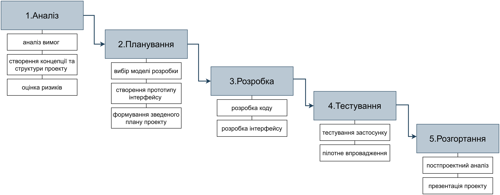

# ЗВЕДЕНИЙ ПЛАН ПРОЕКТУ

Етап: *Планування (Planning)*

Проект: *Застосунок для “ворожіння” на “картах Таро”*

Команда: *КіберВорожки*

Виконали:
>*Доровских*

>*Прізвище студента*

>*Прізвище студента*

## **1.ЗАГАЛЬНИЙ ОПИС**

Зведений план проекту - документ, який включає плани основних необхідних заходів. Сенс документу в тому, що він *об'єднує розрізнені плани в єдине ціле*, встановлюючи необхідні відповідності. 

Документ розробляється різними рольовими кластерами. При цьому *жоден автор не розробляє документ «під себе»* -  плани мають узгоджуватись. Обсяг документа і його наповнення (у тому числі і види планів) можуть варіюватися від проекту до проекту.

## **2. ПЛАН РОЗРОБКИ**
Розділ «План розробки» містить огляд основних складових плану *розробки*. Наводяться цілі, стратегія розробки, особливості процесу розробки (якщо такі є). Авторами цього розділу є розробники.

Ми створюємо веб-застосунок для ворожіння на Таро, і таким чином залучення нових студентів до нашої спеціальності. Дизайн виконується в стилі кіберпанк.

### Основні можливості веб-застосунку:

- при трясінні телефону застосунок повинен вивести на екран “карту” з короткою назвою
- випадкове генерування "карт Таро"
- відображення згенерованих "карт Таро"
- відображення інформації про минуле, сьогодення і майбутнє згенерованих "карт Таро"
- можливість задати питання і отримати відповідь картою та поясненням
- виведення на фінальному екрані логотипу спеціальності (з описом і посиланням на сайт) та тексту, що закликає вступити на  навчання до даної спеціальності

### Для розробки використовується каскадна модель розробки (Waterfall model):

:point_right: Наведіть тут всю необхідну інформацію - що саме буде розроблено (див. п.2.5 документу "[Концепція проекту](/docs/1.Envisioning/%D0%9A%D0%BE%D0%BD%D1%86%D0%B5%D0%BF%D1%86%D1%96%D1%8F%20%D0%BF%D1%80%D0%BE%D0%B5%D0%BA%D1%82%D1%83.md)"), з використанням якої [моделі розробки](/docs/2.Planning/other/%D0%9C%D0%BE%D0%B4%D0%B5%D0%BB%D1%8C%20%D1%80%D0%BE%D0%B7%D1%80%D0%BE%D0%B1%D0%BA%D0%B8.md), вкажіть терміни розробки (з якої по яку дату буде виконуватись написання коду - згадайте календарне планування проекту і зазирніть до *Issues*), з використанням якого ПЗ, технологій та фреймворків буде створене рішення (див. п.3.2 документу "[Концепція проекту](/docs/1.Envisioning/%D0%9A%D0%BE%D0%BD%D1%86%D0%B5%D0%BF%D1%86%D1%96%D1%8F%20%D0%BF%D1%80%D0%BE%D0%B5%D0%BA%D1%82%D1%83.md)")

## **3. ПЛАН ТЕСТУВАННЯ**

Розділ «План тестування» містить огляд основних складових плану *тестування*. Наводяться види тестування, стратегія, основні інструменти тестування, вказуються особливості процесу тестування (у разі потреби). Авторами цього розділу є тестувальники.

:point_right: Наведіть тут всю необхідну інформацію - які види тестів будуть виконуватись, яке ПЗ ви будете використовувати для тестування (див. документ "[Методи тестування](/docs/2.Planning/other/%D0%9C%D0%B5%D1%82%D0%BE%D0%B4%D0%B8%20%D1%82%D0%B5%D1%81%D1%82%D1%83%D0%B2%D0%B0%D0%BD%D0%BD%D1%8F.md)"), вкажіть терміни тестування (з якої по яку дату будуть виконуватись тести - згадайте календарне планування проекту і зазирніть до *Issues*) тощо.

## **4. ПЛАН КОМУНІКАЦІЙ**

Розділ «План комунікацій» містить огляд основних складових плану *комунікацій*.Наводяться основні цілі комунікацій, міркування з секретності і конфіденційності, вказуються основні канали комунікацій (внутрішні та зовнішні), особливості цього процесу (за необхідності). Авторами цього розділу є менеджери програми та продукту.

### Цілі комунікацій:
- інформування замовника про стан розробки проекту після завершення кожного етапу життєвого циклу (ЖЦ)
- відповіді на питання замовника та користувачів
- узгодження дій в команді
- прийняття рішень в команді
- обмін інформацією в команді
- проведення нарад на початку кожного етапу ЖЦ

### Основні канали комунікацій:
- месенджер "telegram"
- відеоконференції на платформі "Google meet"  

### Номер телефону:
- 0994805316, менеджер продукту, Доровских Дмитро Олександрович  

### Конфіденційність:  
Будь яка інформація, яка стосується даного проекту, є конфеденційною та не розголошується третім особам без згоди обох сторін. Наразі вбудованих засобів шифрування достатньо, тому стороннє ПЗ не буде використовуватися

## **5. ПЛАН ПІДТРИМКИ КОРИСТУВАЧІВ**

Розділ «План підтримки користувачів» містить огляд основних складових плану підтримки. Наводяться основні міркування з організації підтримки, вказуються основні види користувачів, формулюються вимоги до зручності отримання інформації та міркування щодо відповідності цим вимогам. Авторами цього розділу є юзер-експірієнс та розробник.

:point_right: Наведіть тут всю необхідну інформацію - куди мають писати/телефонувати кінцеві користувачі у випадку виявлення помилок, питань стосовно використання вашої системи тощо, в які дні тижня/години буде можливість отримати допомогу, хто саме може звертатись в підтримку (менеджмент, кінцеві користувачі, системні адміністратори тощо), яким ще чином вони можуть отримати допомогу - чи є можливість самообслуговування (довідка по роботі з програмою, сторінка питань-відповідей, база знань (вікі), бот тощо). 

## **6. ПЛАН РОЗГОРТАННЯ**

Розділ «План розгортання» містить огляд основних складових плану розгортання системи на стороні замовника. Наводяться розклад і стратегія розгортання, вказуються основні суб'єкти заходів з розгортання в рамках наявної на стороні замовника інфраструктури, терміни, особливості процесу (у разі потреби). Автором цього розділу є спеціаліст з впровадження.

:point_right: Наведіть тут всю необхідну інформацію - що саме розгортається, яким чином (див. п. 5.4 документа "[Структура проекту](/docs/1.Envisioning/%D0%A1%D1%82%D1%80%D1%83%D0%BA%D1%82%D1%83%D1%80%D0%B0%20%D0%BF%D1%80%D0%BE%D0%B5%D0%BA%D1%82%D1%83.md)"), в які терміни (з якої по яку дату буде виконуватись встановлення продукту на стороні замовника - згадайте календарне планування проекту і зазирніть до *Issues*), хто саме буде це робити та з ким взаємодіяти в процесі тощо.

## **7. ПЛАН НАВЧАННЯ**

Розділ «План навчання» містить огляд основних складових плану навчання користувачів. Наводяться основні вимоги до навчання, методи навчання, графік навчання (терміни), особливості процесу (у разі потреби). Автором цього розділу є юзер-експірієнс.

:point_right: Наведіть тут всю необхідну інформацію - кого ви будете навчати роботі з системою (яких працівників/посади/ролі на стороні замовника), коли саме (з якої по яку дату буде здійснюватись навчання замовника - згадайте календарне планування проекту і зазирніть до *Issues*), в який спосіб (презентація в ході відеозустрічі, демонстрація роботи з системою в ході очної зустрічі тощо), про що ще слід подбати в процесі навчання.

## **8. ПЛАН ПІЛОТНОГО ВПРОВАДЖЕННЯ**

Розділ «План пілотного впровадження» містить огляд основних складових плану пілотного (пробного) впровадження системи (для обмеженої кількості користувачів - з метою попередньої оцінки продукту перед його глобальним розгортанням). Авторами цього розділу є спеціаліст з впровадження та менеджер продукту.

Наводяться основні вимоги до впровадження, показники успішності впровадження, графік впровадження, методи оцінки пілотної версії системи за результатами «пробного» впровадження, особливості процесу (у разі потреби).

:point_right: Наведіть тут всю необхідну інформацію - коли саме буде здійснене пілотне впровадження (з якої по яку дату - згадайте календарне планування проекту і зазирніть до *Issues*), кому з працівників замовника (яким категоріям) ви дасте можливість попрацювати з системою, яким чином ви збиратимете відгуки учасників пілотного впровадження (у нашому випадку це буде анкета), за яких умов підотне впровадження ви будете вважати успішним (скільки відсотків відгуків користувачів мають бути схвальними) тощо.

## **9. ПЛАН БЮДЖЕТУ**

Розділ «План бюджету» містить огляд основних складових плану бюджету проекту. Наводяться основні параметри бюджету (загальний бюджет, статті витрат, розподіл ресурсів за цими статтями), особливості фінансування (у разі потреби). Автором цього розділу є менеджер програми.

:point_right: Наведіть тут всю необхідну інформацію - основні статті витрат (див. п. 3.3 документа "[Структура проекту](/docs/1.Envisioning/%D0%A1%D1%82%D1%80%D1%83%D0%BA%D1%82%D1%83%D1%80%D0%B0%20%D0%BF%D1%80%D0%BE%D0%B5%D0%BA%D1%82%D1%83.md)" - можете просто скопіювати таблицю), ваші міркування стосовно особливостей оплати використання ресурсів, можливої інфляції (зростання цін), резервів коштів, непередбачених витрат тощо.

---

- [x] *Доровских*
- [ ] *Прізвище студента*
- [ ] *Прізвище студента*

---
[:arrow_up: Повернутись до початку етапу](/docs/2.Planning/README.md)
